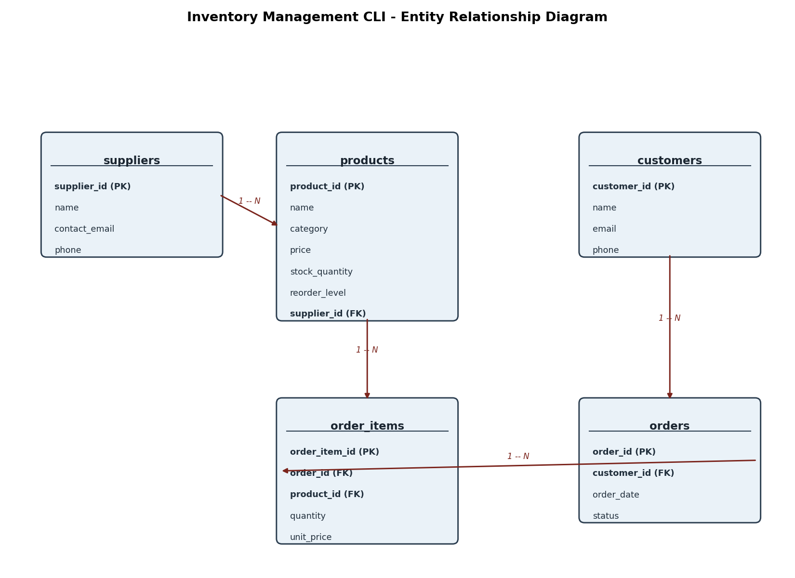

# Inventory Management CLI


A command-line inventory & order management system built with **Python 3** and
**SQLite**. Focuses on solid relational database design and safe, transactional
data operations — no external libraries required.

## Features

- Full CRUD for products, suppliers, and customers
- Input validation on every prompt (rejects empty names, negative prices/stock)
- Order placement wrapped in a **database transaction**: if any item in an
  order can't be fulfilled, the entire order is rolled back
- SQLite **triggers** that:
  - automatically deduct stock when an order item is inserted
  - block an insert if it would drive stock negative (`RAISE(ABORT, ...)`)
- Parameterized queries throughout (no string-formatted SQL — SQL-injection safe)
- Low-stock report via a `JOIN` between `products` and `suppliers`
- Order history report using `JOIN` + `GROUP BY` + aggregate functions
- **Unit tests** (stdlib `unittest`, no dependencies) covering CRUD, the
  low-stock report, and — most importantly — that a failed order truly rolls
  back with zero side effects
- **CI**: tests run automatically on every push via GitHub Actions

## Schema



See [`database/schema.sql`](database/schema.sql) for full DDL, constraints,
indexes, and triggers.

## Getting Started

```bash
git clone https://github.com/<your-username>/inventory-management-cli.git
cd inventory-management-cli

# (optional) load some sample data to explore the app immediately
python src/seed_demo.py

# run the app
python src/cli.py
```

No `pip install` needed — everything uses Python's built-in `sqlite3` module.

## Running the Tests

```bash
python -m unittest discover tests -v
```

Tests run against a temporary, isolated SQLite database (never your real
`database/inventory.db`), so it's always safe to run.

## Project Structure

```
inventory-management-cli/
├── .github/workflows/
│   └── tests.yml          # CI: runs the test suite on every push
├── database/
│   └── schema.sql          # tables, constraints, indexes, triggers
├── docs/
│   └── erd.png             # entity relationship diagram
├── src/
│   ├── database.py         # connection handling + DB initialization
│   ├── models.py           # all CRUD / business logic (parameterized SQL)
│   ├── cli.py               # menu-driven CLI entry point
│   └── seed_demo.py         # loads sample data for demo purposes
├── tests/
│   └── test_models.py       # unit tests (CRUD, rollback, triggers)
├── tools/
│   └── generate_erd.py      # dev tool that generated docs/erd.png
├── requirements.txt
├── LICENSE
└── README.md
```

## Why this project?

Built to demonstrate practical relational database skills for a placement
CV: schema design with foreign keys and constraints, transactions, triggers,
and safe query patterns — using nothing but the Python standard library.

## Possible Extensions

- Add a `sales_summary` view for reporting
- Export the low-stock report to CSV automatically
- Wrap the CLI in a small Flask/FastAPI REST API
